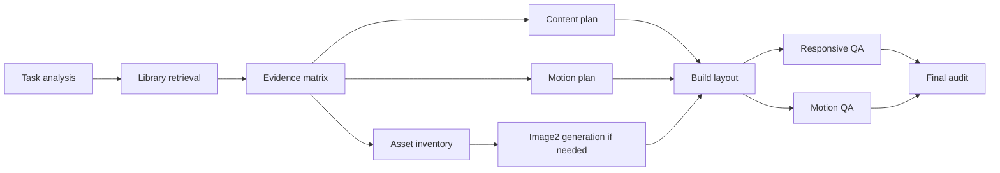

# Use Designstyle

Use local references to preserve transferable design decisions, not to borrow mood words. A good use of references composes multiple evidence dimensions into implementation choices: scene fit, geometry, dimension ratios, typography roles, reference text grammar, style tokens, spacing rhythm, palette source, asset plan, motion logic, motion code evidence, component states, and reuse boundaries.

## Progressive Evidence Layers

Default to progressive disclosure:

- L1 cards: read `~/.codex/designstyle-library/indexes/cards/*.json` first for candidate ranking, evidence strength, and missing evidence.
- L2 dimensions: read only the needed `dimensions/<slug>/*.md` summaries for scene, layout/spacing, type/copy, color/surface, assets, motion/code, or components/states.
- Design systems: read `design-systems/<slug>/tokens.json`, `palette.md`, `moodboard.svg`, and `component-styles.md` when the task needs color systems, moodboards, component styling, or token-level reuse.
- Retained component systems: when implementation-grade component styling is needed, check the linked `assets/YYYY-MM-DD-<slug>-component-styles.json` evidence from the full reference or tokens before trusting a summarized component rule. Use exact computed styles for density, radius, border, shadow, padding, typography, and hover/focus deltas; keep missing states explicit.
- L3 full references: read `references/*.md` only when the L2 summary is insufficient, contradictory, contaminated, or implementation-grade detail is required.
- L4 on-demand evidence: retained screenshots and component-style JSON are checked only when visual/code evidence needs verification. Raw DOM is not kept in the default library; if L0-L3 plus retained components are insufficient, recapture the source URL into an external temp location and extract only the needed facts.

Do not jump straight to full references unless the task needs L3/L4 evidence. Do not claim typography, spacing, copy, motion, or code evidence exists if L1/L2 marks it missing.

## Library

Default location:

```text
~/.codex/designstyle-library/
```

If the library is empty or weak for the product scene, say so and either re-query or ask to run `add-designstyle`.

## On-Demand Image2 Asset Regeneration

When a design or redesign needs stronger visual assets than the library provides, regenerate assets only after the reference matrix has defined the asset role, composition, ratio, palette relationship, and reuse boundaries. Use generated images to fill product/scene/material gaps; do not use them to copy a reference's original images, brand marks, product claims, text, or exact campaign imagery.

Before calling image2, verify the current provider instead of hardcoding one:

- Read `~/.codex/config.toml` and use the active `model_provider` plus its `model_providers.<name>.base_url`.
- Read `~/.codex/auth.json` only to confirm an `OPENAI_API_KEY`-compatible credential exists. Never print or paste secret values.
- Environment overrides such as `OPENAI_IMAGE_BASE_URL`, `OPENAI_IMAGE_API_KEY`, `OPENAI_BASE_URL`, and `OPENAI_API_KEY` may take precedence when already present.
- Prefer the existing `gpt-image-2` helper when available, for example `python3 ~/.codex/skills/gpt-image-2/scripts/gpt_image.py generate ...`, because it already reads Codex config/auth, validates image sizes, handles retries, and writes files to disk.
- If the active provider, base URL, image model support, helper script, or credential is missing, say exactly what is missing and continue with an explicit asset plan or stable placeholders. Do not silently switch to a similar provider or pretend generation happened.

For every generated or edited asset:

- Derive the prompt from the selected references' transferable dimensions: asset role, subject, camera/framing, material, lighting, palette source, negative space, and forbidden copied assets/text/brand elements.
- Choose the size from the target UI ratio before generation.
- Save outputs in the current project/workspace asset path or `work/`; use `/outputs` only for user-facing deliverables.
- Visually inspect the saved image before using it, checking composition, text accuracy if any, unwanted brand marks, watermarks, and fit with the UI direction.
- Record the generated asset path, provider source (`config.toml`/env), prompt intent, and any evidence limits in the final audit.

## Library Coverage Checks

Before using references for a design task, check whether the library covers the requested scene:

- Count candidate matches by `category_tags`, `page_scope`, `best_for`, and `avoid_for`, not only by style words.
- Prefer references with screenshots, page scope, code surface, motion evidence, and self-review. Demote references with explicit evidence limits.
- Prefer references that preserve reference text samples, style token grammar, and measured spacing/gap evidence when the target task asks for a complete visual system rather than mood only.
- Prefer references with retained design-system artifacts when the target task needs color palette, moodboard, component styling, or reusable tokens. Do not use a color mood adjective when exact palette evidence is available.
- If a category is underrepresented, say what is missing and run a narrower query. If the result is still weak, state that the library lacks implementation-grade references for that scene.
- For large or mixed libraries, use references by role: scene, structure, type/color, asset, motion/code, and component states. Do not let a high-scoring but wrong-category entry dominate.
- Treat page/category fit as the retrieval gate. Generic motion/code words such as `transition`, `hover`, `scroll`, `animation`, or `css` must not let an unrelated gallery, portfolio, or editorial page outrank a same-scene pricing/product/dashboard reference. Use motion/code evidence only after scene, page scope, and category fit are plausible.

## Coverage Strength

Classify library coverage before planning:

- strong: scene, page scope, structure, type/color, spacing, and component or motion evidence are enough for the requested deliverable.
- partial: enough for selected dimensions, but not enough for a complete visual system or implementation-grade guidance.
- weak: only suitable as loose inspiration. Do not treat it as implementation-grade evidence.

Coverage strength must be based on scene/page fit plus evidence strength, not the top search score alone.

## Workflow

Use this fixed flow whenever the skill is active. Keep the output compact, but do not skip gates.

Hard rule: task analysis and designstyle-library retrieval are mandatory. Do not produce a design direction, planning file, image2 prompt, or implementation plan from taste alone unless the library is missing or explicitly too weak; in that case, state the gap first.

### 1. Brief

Capture the design need before searching:

- Product category and commerce/workflow context.
- Page type and scope: homepage, product detail, pricing, docs, dashboard, portfolio, article, checkout, app screen, campaign, gallery, or listing.
- User frequency: repeated task, one-time browsing, campaign launch, product inspection.
- Desired feeling: name concrete mechanics, not just adjectives.
- Content shape: narrative, product catalog, formula proof, media, forms, diagnostic flow.
- Technical constraints: framework, devices, accessibility, performance, assets.
- Required evidence level: visual-only mood, layout guidance, or implementation-grade motion/code guidance.

Output this as a short `Task Analysis` block before showing references.

### 2. Upfront HITL Gate

HITL happens before planning and implementation, not repeatedly during build. Ask for the missing inputs needed to make the direction plan complete, then let the plan file drive execution. Do not keep interrupting the user during build unless a hard blocker appears.

Collect or infer from the user's message, then explicitly confirm:

- Style anchors: concrete source-material traits to preserve, such as museum display, stone plinths, clinical grid, editorial warmth, instrument-panel density, or hand-drawn craft.
- Forbidden drift: directions that would betray the request, such as generic luxury, SaaS dashboard, stock lifestyle, marketing hero, collage portfolio page, or decorative-only motion.
- Motion richness level:
  - L1 basic: reveal, hover, simple parallax.
  - L2 rich: scroll progress, mask reveal, pointer light, chapter handoff, number animation, button light sweep, stateful hover/focus.
  - L3 cinematic: timeline choreography, scene transitions, pinned scroll, multi-layer depth, coordinated media/copy movement.
  If the user asks for rich/high-quality motion, default to L2 minimum unless constraints make that unsafe.
- Asset boundaries: must-use, usable, risky, and rejected assets; whether generated assets may fill gaps; final deliverable format and asset embedding requirements.
- Required QA states: first viewport, mobile, key sections, hover/focus, immediate-load, post-animation, reduced motion, and any user-named state.

Rules:

- If the user has already provided clear answers, restate them compactly and proceed; do not ask again.
- If inputs are missing but low-risk, make conservative assumptions and write them into the plan as assumptions.
- Ask the user only when a missing input would change the visual direction, asset rights/usage, deliverable format, or motion scope.
- Once the user confirms these inputs, the build proceeds from the plan without repeated confirmation.

### 3. Coverage Gate

Check whether the library covers the scene before using any reference:

- Search L1 cards first and rank by `category_tags`, `page_scope`, `best_for`, `avoid_for`, evidence strength, and missing evidence.
- Run at least one `search_references.py` query using the product scene plus mechanics from the brief.
- Decide whether the library is strong, partial, or weak for this task.
- If weak or wrong-category, re-query once with stronger scene/page terms. If still weak, say the gap and continue only with explicit uncertainty or ask to run `add-designstyle`.
- Treat page/category fit as the retrieval gate. Motion/code words help only after scene and page fit are plausible.

The coverage result must name the queries used, selected candidates, rejected candidates if relevant, and why the final references are scene/page-fit. This is the guardrail that keeps the local aesthetic library useful.

If coverage is `partial` or `weak`, output this block before implementation:

```markdown
## Add-Designstyle Backlog
- Missing scene:
- Missing page scope:
- Missing dimensions:
- Needed evidence level:
- Suggested reference type:
- Candidate query direction:
- Why current library is insufficient:
```

### 4. Role-Based Retrieval

Retrieve references by role rather than letting one top result dominate. Use 2-5 references maximum:

- Scene/style: product category, audience, trust problem, tone.
- Structure/ratio: first viewport geometry, page grid, media/product-card proportions.
- Type/color: typography roles, color/material system, contrast.
- Design system: exact palette roles, moodboard, component style rules, and token evidence from `design-systems/<slug>/`.
- Component-code: retained computed component samples from `assets/*-component-styles.json` when available.
- Text grammar: H1/H2/eyebrow/CTA/body/meta copy rhythm, claim density, naming style, and tone mechanics.
- Style/spacing: surface system, borders/radii/shadows, control density, header/hero/section gaps, grid gutters, card padding, and mobile compression.
- Assets: photography/video/material production plan.
- Motion/code: transition, animation, keyframes, exact duration/easing/transform parameters, runtime library, reduced-motion strategy.
- Components/states: navigation, cards, forms, drawers, search, menus, pricing tables, dashboard tables, galleries, or feedback states.

One reference can cover multiple roles, but never assume it covers all roles. If page/category fit does not match, use the reference only for the specific dimensions where evidence clearly transfers. `motion/code` evidence cannot bypass the scene/page fit gate.

Search with product scene plus mechanics:

   ```bash
   python ~/.codex/skills/use-designstyle/scripts/search_references.py "skincare clinical minimal formula product grid swiper transition" --matrix --explain-selection
   python ~/.codex/skills/use-designstyle/scripts/search_references.py "skincare clinical minimal formula product grid" --dimension type-copy
   python ~/.codex/skills/use-designstyle/scripts/search_references.py "dashboard analytics color system table components" --dimension color-surface --full
   ```

STOP: If top L1 cards are generic, contradictory, contaminated, or unrelated, re-query or say the library lacks a good match. Do not force a SaaS or culture reference onto beauty, retail, spa, or product pages just because tags include `product` or `motion`.
STOP: If a result ranks mainly because of generic motion/code snippets while `category_tags`, `page_scope`, and `best_for` do not match the task, demote it manually and re-query with stronger scene/page terms.

### 5. Evidence Matrix

Do not copy one reference wholesale. Build a matrix with these columns:

- Requirement dimension.
- Selected reference.
- Category/page fit.
- Evidence strength: screenshot/DOM/CSS/JS strong, runtime inference medium, visual-only weak.
- Transferable element: the specific decision to reuse.
- Adaptation rule: how it changes for the user's product/content/assets.
- Reuse boundary: what must not be reused directly.

Include rows for reference text grammar and style/spacing whenever the output is a webpage, landing page, app screen, or visual system.

For each selected reference, extract only dimensions that matter to the task:

- First viewport geometry: bars/header/nav/logo/hero/copy/CTA/next-section visibility.
- Page scope and secondary pages inspected.
- Dimension ratios: viewport, hero min-height, split ratios, product/media card ratios, header/drawer bounds.
- Typography roles: display, UI, body, metadata, CTA, technical labels.
- Reference text grammar: headline length and shape, eyebrow role, CTA verbs, claim density, technical vs editorial vocabulary, whether copy is terse, narrative, catalog-like, clinical, playful, or restrained.
- Style tokens: background/surface layers, border/radius/shadow grammar, button/input density, icon stroke style, divider usage, hover/focus states.
- Spacing rhythm: header height, hero top/bottom padding, section gaps, grid gutters, media margins, card padding, text measure, CTA spacing, mobile spacing compression.
- Color source: shell palette vs asset-derived palette.
- Design system: retained palette colors, color roles, moodboard direction, component style rules, source attribution, and missing evidence limits.
- Asset plan: required photo/video/product/material quality.
- Motion purpose and mechanism: source video, reveal, drawer, hover, scroll, timing, state transition, depth/parallax, or carousel behavior.
- Motion code: CSS transition/animation/keyframes, exact duration/easing/delay/transform parameters, GSAP/Swiper/Slick/Owl/Framer evidence, `IntersectionObserver`, `requestAnimationFrame`, reduced-motion handling.
- Code surface: CSS variables/tokens, layout primitives, framework/runtime hints, component naming clues, and media loading patterns.
- Component grammar: nav, buttons, cards, forms, search, cart, overlays, feedback states.
- Component raw evidence: computed component JSON sample path, sampled component categories, geometry, computed styles, and observed hover/focus deltas.
- Implementation primitives: split hero, full-bleed media, product grid, sticky header, drawers, aspect ratios.
- Community signal: why this reference was worth saving and what feedback theme it represents.
- Evidence strength and contamination: screenshot/source/DOM strong, inference weak, cookie/region/modal ignored, and Cloudflare/security challenge pages excluded.

### 6. Reuse Boundary

Be practical and precise. It is acceptable to reuse design mechanics and implementation ideas:

- Layout structures, viewport proportions, grid behavior, sticky regions, drawers, menus, cards, and state models.
- Motion mechanisms, easing/duration ranges, transform patterns, reveal logic, scroll triggers, carousel strategy, and reduced-motion fallbacks.
- Component density, spacing rhythm, token roles, surface grammar, and interaction affordances.

Do not reuse directly:

- Original photos, videos, illustrations, icons, logos, trademarks, product renders, or brand marks.
- Original copy, product claims, campaign slogans, pricing language, testimonials, or named proprietary concepts.
- A reference's complete page arrangement when it is so distinctive that the result is recognizably the same campaign or brand expression.
- Full proprietary CSS/JS files or large verbatim code blocks. Keep short public snippets only when needed as evidence, and translate them into local implementation.

### 7. Design Direction

Before producing the final direction or implementation, create a process file named `work/designstyle-direction-plan.md` unless the user asks for a different path. This file is required for webpage, landing page, app screen, visual system, prototype, or any build that will use image2/assets/motion. If the workspace cannot write files, include the same structure in the response and say the file could not be created.

The process file must start with the task analysis, upfront HITL inputs, and the designstyle-library evidence. Do not let it become a pure creative brief. Treat this file as the execution contract.

Required sections:

````markdown
# Designstyle Direction Plan

## 1. Task Analysis
- Final deliverable:
- Page/screen scope:
- Product/category context:
- Audience/use frequency:
- Technical target:
- Evidence level:

## 2. Library Retrieval And Coverage
- Queries run:
- Evidence layers read:
- Selected references by role:
- Rejected/weak references:
- Coverage strength:
- Missing reference gaps:
- Add backlog:
- Evidence strength per role:

## 3. Upfront HITL Inputs And Assumptions
- Confirmed style anchors:
- Forbidden drift directions:
- Motion richness level:
- Asset boundaries:
- Final deliverable format:
- Required QA states:
- Assumptions made without asking:
- Hard blockers that would require returning to the user:

## 4. Final Output Content Plan
| Section | Purpose | Content Blocks | Layout/Ratio | States | Acceptance |
|---|---|---|---|---|---|

## 5. Motion System Plan
| Scope | Motion | Trigger | Duration/Easing | Connects From | Connects To | Reduced Motion |
|---|---|---|---|---|---|---|

## 6. Asset And Image2 Plan
| Asset | Used In | Status | Source/Path | Need image2? | Prompt Intent | Size/Ratio | Verification | Decision |
|---|---|---|---|---|---|---|---|---|

## 7. Global Background And Surface Plan
- Background role:
- Color/material basis:
- Surface layers:
- Texture/noise/media:
- Responsive behavior:
- Contrast/accessibility:

## 8. Reuse Boundaries
- Reusable mechanics:
- Do not reuse directly:

## 9. Stepwise Build Plan
| Step | Action | Depends On | Verification | Status | Iteration Notes |
|---|---|---|---|---|---|

## 10. Iteration Log
| Time | Trigger | Plan Change | Implementation Change | Verification |
|---|---|---|---|---|

## 11. Execution Graph


## 12. Execution Order
- Serial:
- Parallel:
- Blocked until:
- Verification:

## 13. Final QA Checklist
- Immediate first viewport:
- Post-animation first viewport:
- Desktop key sections:
- Mobile key sections:
- Hover/focus states:
- Motion richness level met:
- Reduced motion:
- Asset usage matches plan:
- No forbidden drift:
- No external/placeholder assets unless planned:
````

Planning rules:

- Final output content plan must list every major section/screen block, what content belongs there, its layout/ratio role, states, and acceptance check.
- Motion plan must define global motion language, per-section motion, triggers, timing/easing, how motions hand off between sections, and reduced-motion fallback.
- Asset plan must inventory existing assets and missing assets separately, after visual inspection when assets are available. Classify each asset as must-use, usable, risky, or rejected; do not infer suitability from filenames alone. For each missing generated asset, specify what content it represents, where it will be used, prompt intent, target ratio, and visual verification criteria before calling image2.
- Global background plan must define whether the page uses solid color, layered surfaces, image/video, texture, noise, gradient, or mixed material, plus responsive and contrast constraints.
- Execution graph must distinguish serial dependencies from parallelizable work. Task analysis, library retrieval, and evidence matrix are serial. Content plan, motion plan, and asset inventory may run in parallel after the evidence matrix. Image2 generation waits for asset roles and prompt intents. Build waits for content, motion, and required assets.
- Stepwise build plan must be specific enough for an agent to follow without inventing direction. Each step needs a verification check and a status field.
- Iteration log must be updated whenever style, assets, motion level, layout structure, or generated-image role changes.

Produce a compact direction before implementation:

- Scene and audience.
- Visual stance.
- First viewport geometry.
- Dimension/ratio system.
- Type roles.
- Reference text grammar.
- Style tokens.
- Spacing rhythm.
- Color/material.
- Asset production plan.
- Image2 regeneration plan.
- Motion/code plan.
- Components/states.
- Reuse boundaries.
- Direction plan path.
- Reference element matrix.
- Missing-reference warning.

### 8. Build Or Generate

During implementation or asset generation, follow `work/designstyle-direction-plan.md` step by step and update it as work proceeds:

- Does the UI match the product scene, not merely the color palette?
- Are real assets, generated assets, or placeholders strong enough for the borrowed style?
- Did you preserve macro geometry, ratios, and typography roles?
- Are motion and transitions causal and backed by the chosen motion/code reference?
- Are the selected references category-fit, page-fit, and evidence-fit?
- Are text, spacing, contrast, responsive layout, and states robust?
- Did you avoid direct reuse of protected brand identity, original media, and original copy?
- Did each completed build step update its status and verification result in the direction plan?
- If implementation deviated from the plan, was the plan updated first with the reason and new verification target?

Do not ask the user for repeated confirmation during build. Return to the user only for hard blockers:

- Requirements conflict or the confirmed style anchors contradict new evidence.
- Required assets, auth, provider support, or tooling are missing.
- Continuing would violate the confirmed asset boundary, deliverable format, or reuse boundary.
- A new direction, feature, page, or motion level beyond the confirmed plan becomes necessary.

### 9. Final Audit

Before claiming completion, audit:

- Which references were used and which exact dimensions were borrowed.
- Which dimensions were intentionally not borrowed and why.
- Which upfront HITL inputs were followed and which assumptions were used.
- Whether the stepwise build plan status and iteration log are current.
- Whether screenshots/assets/text show the reference decisions in the final UI.
- If image2 was used: provider source, generated asset paths, visual verification result, and whether any fallback was needed.
- Interaction quality: hover, drawer/modal, loading/empty/error states.
- Motion quality: purpose, timing, implementation technique, reduced-motion fallback.
- Reference fit quality: scene, page scope, category diversity, evidence strength, and contamination.
- Anti-patterns: generic gradients, decorative blobs, nested cards, stock filler, vague "premium" styling.

## Output Pattern

```markdown
## Selected References
- Task analysis:
- Evidence layers read: L1 cards -> L2 dimensions -> L3 full references if needed.
- <reference>: use for <specific dimension>; evidence strength <strong/medium/weak>.
- Coverage: <strong/partial/weak> for <scene/page>; missing <gaps>.

## Reference Element Matrix
| Need | Reference | Category/Page Fit | Evidence | Reuse | Adapt | Reuse Boundary |
|---|---|---|---|---|---|---|
| Scene/style |  |  |  |  |  |  |
| Structure/ratio |  |  |  |  |  |  |
| Type/color |  |  |  |  |  |  |
| Text grammar |  |  |  |  |  |  |
| Style/spacing |  |  |  |  |  |  |
| Assets |  |  |  |  |  |  |
| Motion/code |  |  |  |  |  |  |
| Components/states |  |  |  |  |  |  |

## Direction Plan File
- Path: `work/designstyle-direction-plan.md`
- Upfront HITL inputs:
- Content plan summary:
- Motion system summary:
- Asset/image2 plan summary:
- Global background/surface summary:
- Stepwise build plan summary:
- Iteration log summary:
- Execution graph summary:

## Design Direction
- Scene:
- First viewport geometry:
- Dimension/ratio system:
- Type roles:
- Reference text grammar:
- Style tokens:
- Design system:
- Spacing rhythm:
- Color/material:
- Assets:
- Image2 regeneration:
- Motion/code:
- Components/states:
- Reuse boundaries:
- Missing references:

## Do Not Do
- Skip task analysis or designstyle-library retrieval.
- Treat weak references as implementation-grade evidence.
- Generate image2 assets before asset roles, prompt intent, and ratios are planned.
- Start build work before the direction planning file is complete.
- Keep asking the user for build confirmations after the upfront HITL gate unless a hard blocker appears.
- Continue after a direction-changing deviation without updating the plan file first.

## Build Checks
- Library evidence is represented in the final UI, not just named.
- Content, motion, assets, and background match the direction plan.
- Serial/parallel execution order from the graph was followed or deviations are explained.
- Stepwise build plan statuses and iteration log were updated.
- Responsive layout, interaction states, hover/focus states, immediate-load state, post-animation state, and reduced-motion fallback are checked.

## Final Audit
- References and reused dimensions:
- Upfront HITL inputs followed:
- Direction plan followed:
- Iterations recorded:
- Generated assets and provider source:
- Motion/state verification:
- Remaining evidence gaps:
```

## Failure Handling

| Trigger | First response | Fallback |
|---|---|---|
| Library lacks scene-fit references | Say so and run/add references first | Use general design judgment with uncertainty |
| Search returns generic matches | Re-query with scene + mechanics | Manually inspect fewer references |
| Search returns wrong-category matches | Re-query with category/page scope and `avoid_for` terms | State the gap and use only weak inspiration |
| References conflict | Pick one primary and demote others by dimension | Do not blend incompatible aesthetics |
| One reference fits style but not layout/motion | Keep it only for the fitting dimension | Select separate structure or motion references |
| Assets are missing | Define an asset plan before layout polish | Use stable placeholders only as temporary scaffolding |
| User-provided assets are visually ambiguous | Inspect and classify must-use/usable/risky/rejected before layout | Ask only if the asset boundary changes the confirmed direction |
| User requests rich or high-quality motion | Default to L2 rich motion and list layers in the motion plan | Reduce only if performance/accessibility constraints require it |
| Image2 provider or auth is missing | Say which part is missing from `config.toml`, `auth.json`, env, or helper support | Continue with an explicit asset plan or placeholders; do not use an unverified alternate provider |
| Reference has contamination | Ignore cookie/region/modal as aesthetic evidence; exclude Cloudflare/security challenge pages | Prefer clean screenshot or exclude reference |
| Motion/code evidence is weak | Use it only as motion intention | Do not copy exact timing or claim implementation backing |
| 50+ library has near-duplicates | Pick the most evidence-rich entry and one contrasting reference | Do not use five same-category references to justify one design |
| Implementation constraints conflict | Reduce media/motion first | Preserve hierarchy, typography roles, spacing, states |

## Do Not Do

- Do not copy original images, videos, illustrations, icons, logos, trademarks, product renders, brand marks, original copy, product claims, campaign slogans, pricing language, testimonials, or named proprietary concepts.
- Do not treat layout, motion, interaction models, easing/duration ranges, component density, spacing rhythm, or implementation primitives as forbidden by default. Reuse them when they fit the user's scene and adapt them to the local product.
- Do not reduce references to adjectives like "luxury", "clean", "natural", or "premium".
- Do not use references with weak evidence as implementation-grade guidance.
- Do not treat the top search result as the whole answer. Use different references for different dimensions when that is more accurate.
- Do not implement before task analysis, library retrieval, the reference element matrix, and the direction planning file are complete when design direction or build work is requested.
- Do not repeatedly ask the user during build after upfront HITL inputs are confirmed; use the plan file as the execution contract.
- Do not use image filenames as proof of visual suitability. Inspect actual images when available.
- Do not ship hover/focus, immediate-load, or post-animation states without checking readability and layout.
